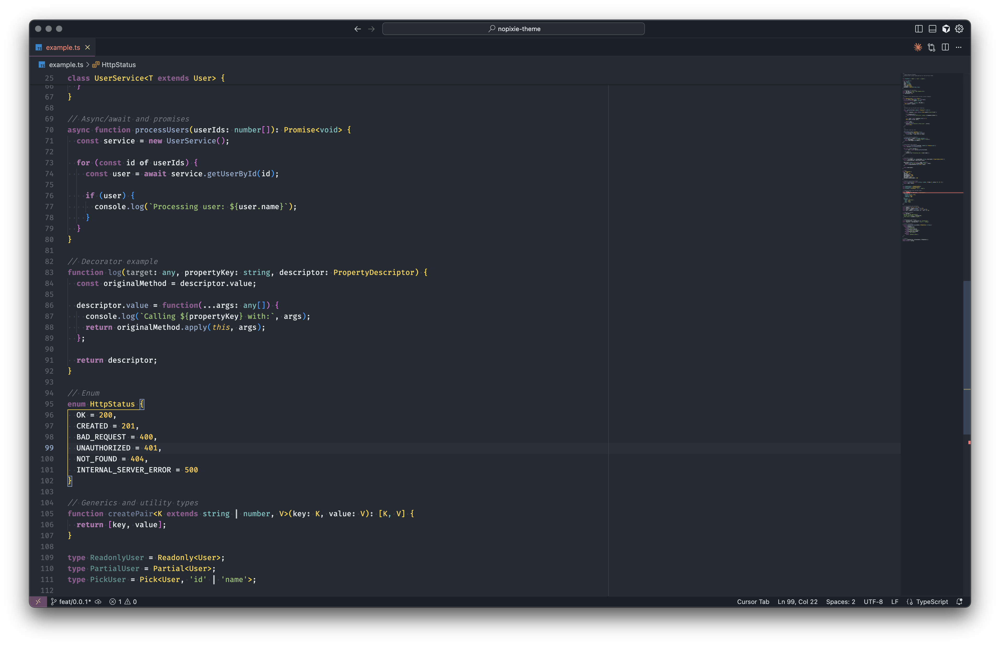
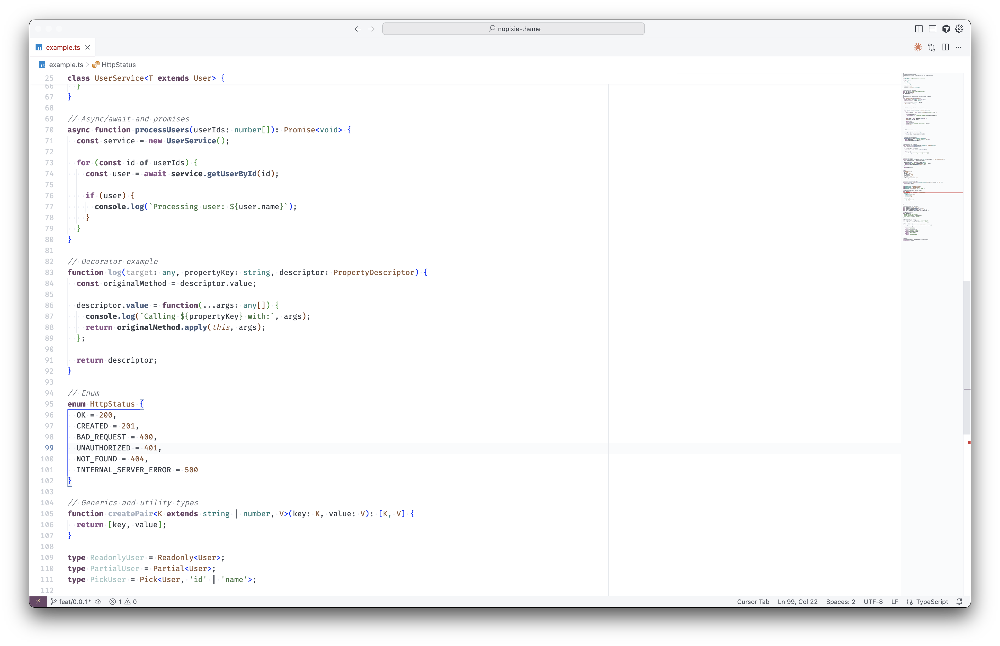

# No Pixie Theme

A minimal and carefully crafted color theme for Visual Studio Code, available in both dark and light variants.

## Features

- 🌙 **Dark Mode**: Easy on the eyes with carefully selected colors for extended coding sessions
- ☀️ **Light Mode**: Clean and crisp for those who prefer working in bright environments
- 🎨 **Minimal Design**: Thoughtfully designed color palette that reduces visual clutter
- 💻 **Syntax Highlighting**: Optimized for readability across multiple programming languages

## Installation

1. Open **Extensions** sidebar in VS Code (`Ctrl+Shift+X` or `Cmd+Shift+X`)
2. Search for `No Pixie`
3. Click **Install**
4. Click **Reload** to refresh your editor
5. Go to `File > Preferences > Color Theme > No Pixie Dark` or `No Pixie Light`


Or install via command line:
```bash
code --install-extension no-pixie.nopixie-theme
```

## Examples

### Dark Theme

The dark variant provides a comfortable viewing experience with reduced eye strain during long coding sessions.



### Light Theme

The light variant offers a clean, professional look with excellent contrast for well-lit environments.



## Activation

After installation, you can activate the theme by:

1. Press `Ctrl+K Ctrl+T` (or `Cmd+K Cmd+T` on macOS)
2. Select either **No Pixie Dark** or **No Pixie Light**

Alternatively:
- Open Command Palette (`Ctrl+Shift+P` or `Cmd+Shift+P`)
- Type `Preferences: Color Theme`
- Select your preferred No Pixie theme

## Feedback & Contributing

Found an issue or have a suggestion? Please open an issue on our [GitHub repository](https://github.com/nopixie/nopixie-theme).

## License

MIT License - see [LICENSE](LICENSE) file for details
