<p align="center">
  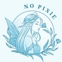
</p>

<p align="center">
  <a href="https://marketplace.visualstudio.com/items?itemName=no-pixie.nopixie-theme"></a>
  <a href="https://marketplace.visualstudio.com/items?itemName=no-pixie.nopixie-theme"></a>
</p>

<p align="center">
  <a href="https://marketplace.visualstudio.com/items?itemName=no-pixie.nopixie-theme"></a>
  <a href="https://open-vsx.org/extension/no-pixie/nopixie-theme"></a>
</p>

<p align="center">
  <a href="https://marketplace.visualstudio.com/items?itemName=no-pixie.nopixie-theme"></a>
  <a href="https://open-vsx.org/extension/no-pixie/nopixie-theme"></a>
</p>

<p align="center">
  <a href="https://github.com/nopixie/nopixie-theme"></a>
  <a href="https://github.com/nopixie/nopixie-theme/blob/main/LICENSE"></a>
</p>

---

# No Pixie Theme

A minimal and carefully crafted color theme for Visual Studio Code, featuring both color themes and matching icon themes in multiple variants.

## Features

- 🌙 **Dark Mode**: Easy on the eyes with carefully selected colors for extended coding sessions
- ☀️ **Light Mode**: Clean and crisp for those who prefer working in bright environments
- 🔆 **High Contrast Variants**: Enhanced contrast versions of both dark and light themes for improved accessibility
- 💧 **Blue Variants**: Cool blue/cyan color palette inspired by rainy atmosphere for a calming coding experience
- ☀️ **Yellow Variants**: Warm yellow/amber color palette inspired by cozy atmosphere for a comfortable coding experience
- 🎨 **Minimal Design**: Thoughtfully designed color palette that reduces visual clutter
- 💻 **Syntax Highlighting**: Optimized for readability across multiple programming languages
- 🗂️ **Icon Themes**: Three comprehensive icon themes (Purple, Blue, Yellow) that match each color palette with support for folders, files, and 40+ file types

## Installation

1. Open **Extensions** sidebar in VS Code (`Ctrl+Shift+X` or `Cmd+Shift+X`)
2. Search for `No Pixie`
3. Click **Install**
4. Click **Reload** to refresh your editor
5. Go to `File > Preferences > Color Theme > No Pixie Dark` or `No Pixie Light`


Or install via command line:
```bash
code --install-extension no-pixie.nopixie-theme
```

## Examples

### Dark Theme

The dark variant provides a comfortable viewing experience with reduced eye strain during long coding sessions.

#### Javascript, Typescript, Vue and React
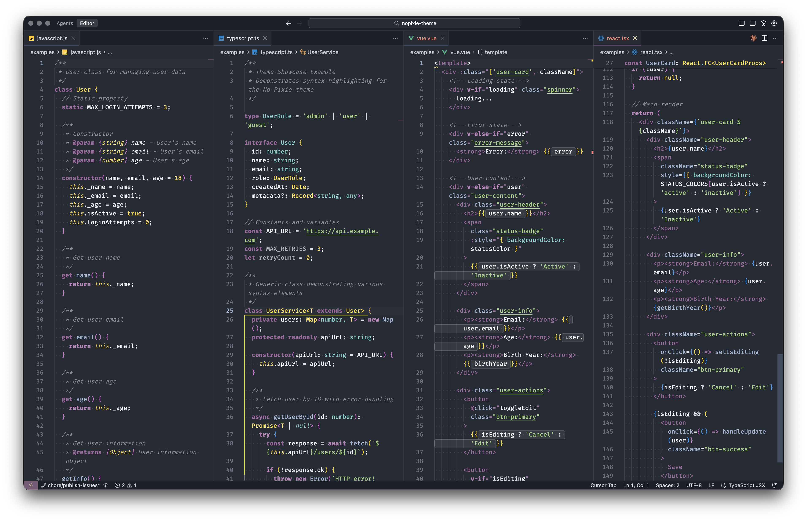

#### Python and PHP
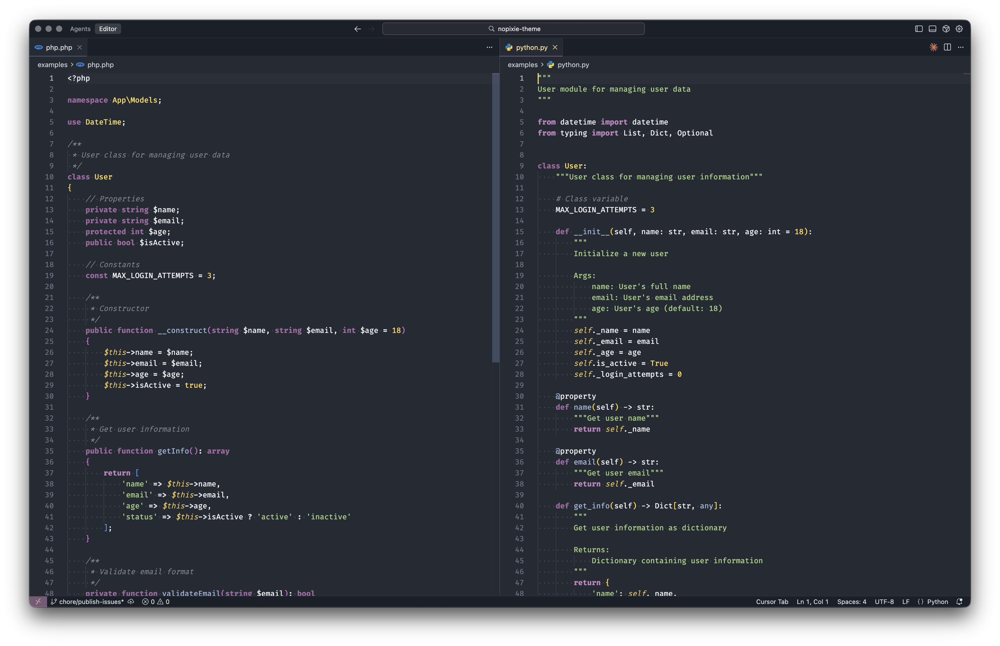


### Light Theme

The light variant offers a clean, professional look with excellent contrast for well-lit environments.

#### Javascript, Typescript, Vue and React
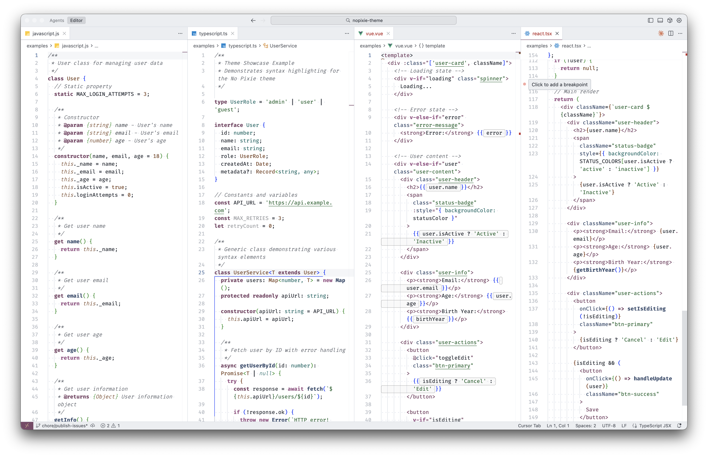

#### Python and PHP
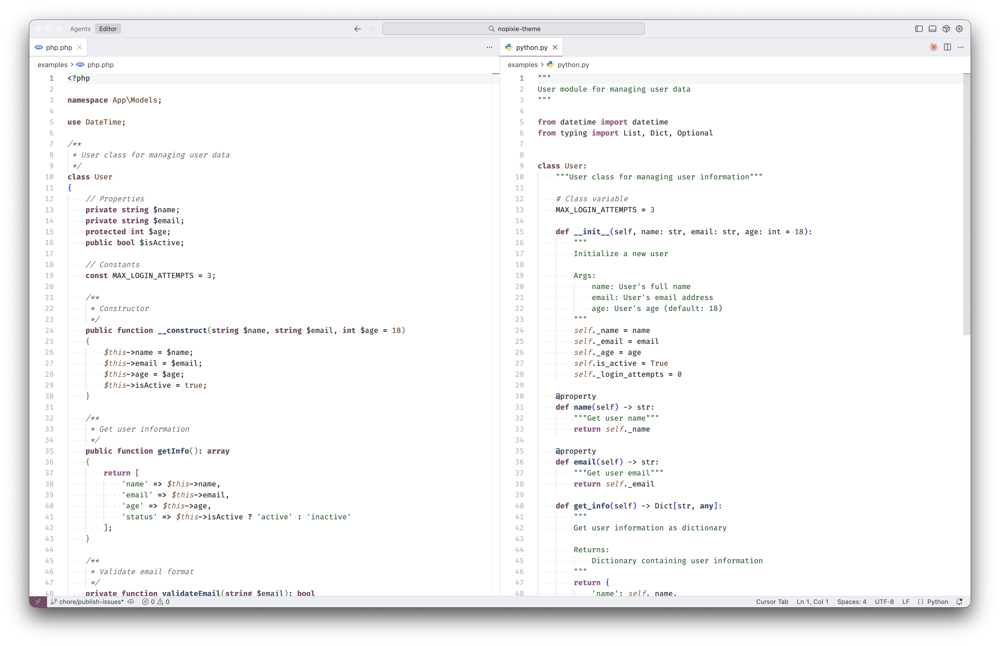


### High Contrast Dark Theme

The high contrast dark variant provides enhanced contrast for improved accessibility and visibility.

#### Javascript, Typescript, Vue and React
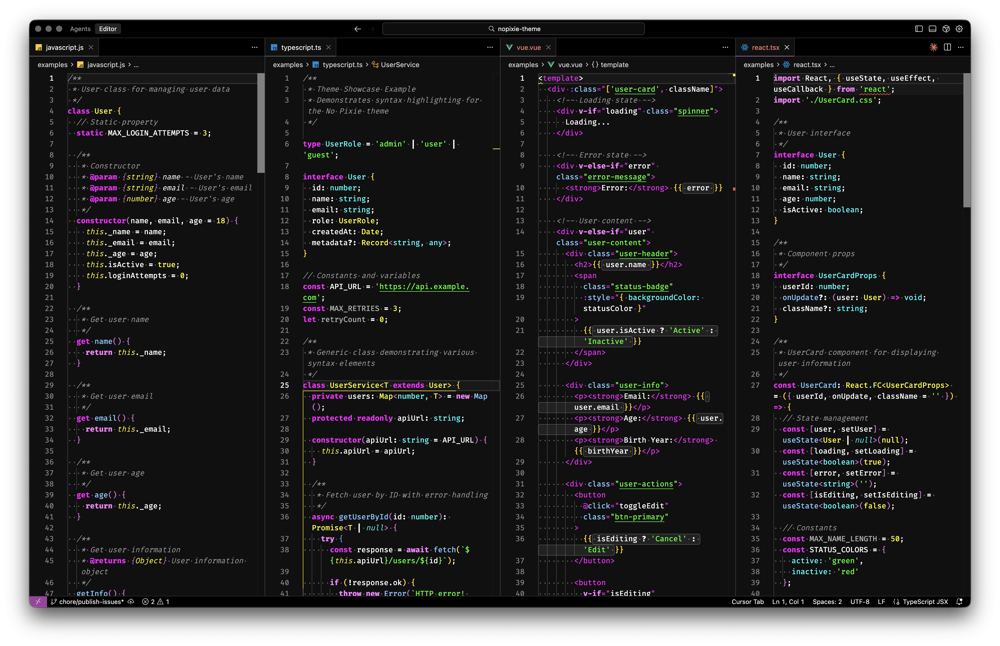

#### Python and PHP
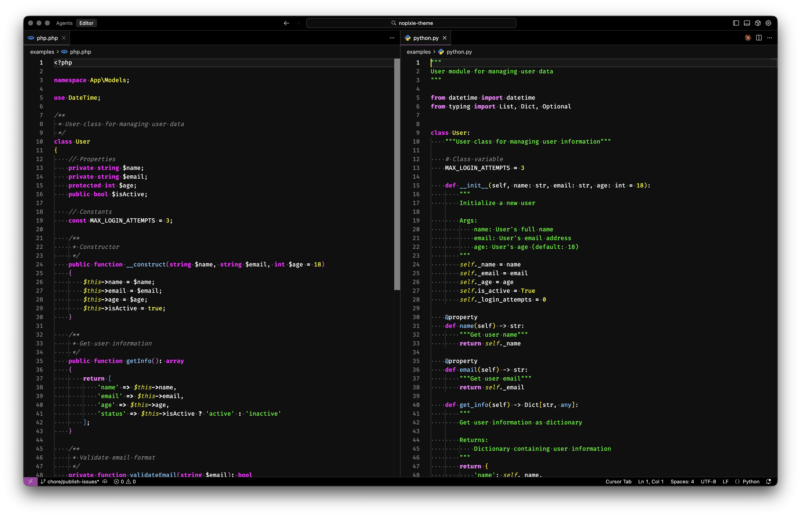


### High Contrast Light Theme

The high contrast light variant offers maximum contrast for accessibility needs in bright environments.

#### Javascript, Typescript, Vue and React
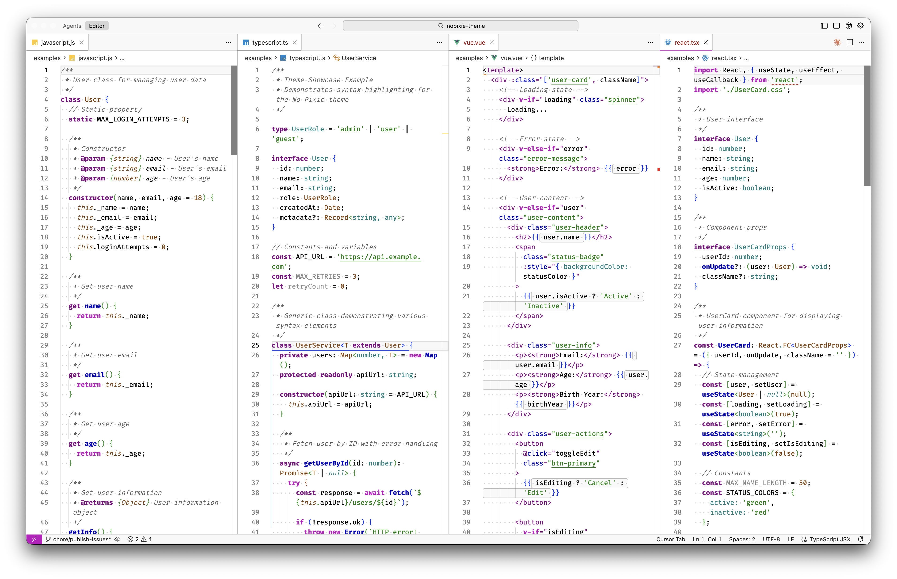

#### Python and PHP
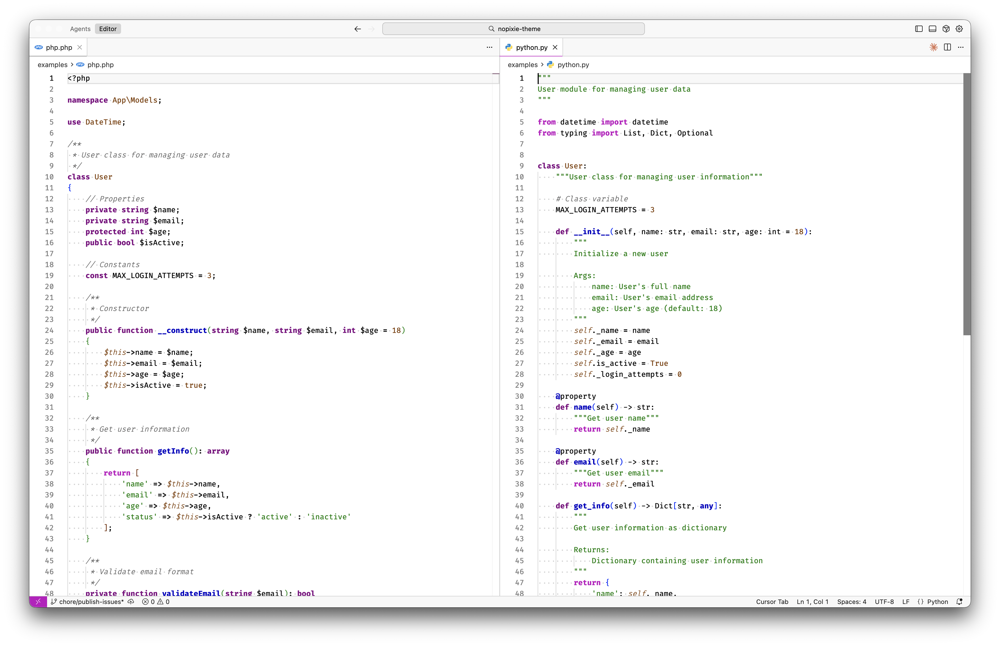


## Icon Themes

The No Pixie theme includes three comprehensive icon themes designed to match each color palette variant. Each icon theme provides consistent, minimal icons for folders and 40+ file types.

### Purple Icon Theme

The Purple icon theme matches the original No Pixie purple color palette with elegant purple accents.

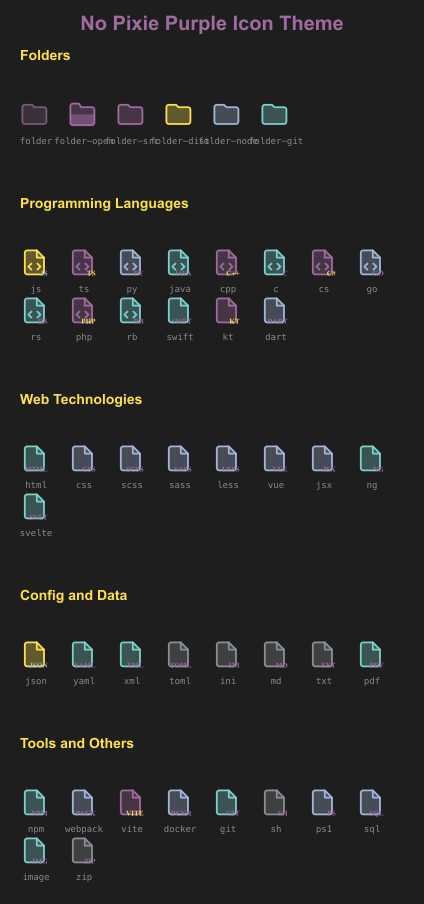

### Blue Icon Theme

The Blue icon theme features cool blue/cyan tones that complement the Blue theme variants.

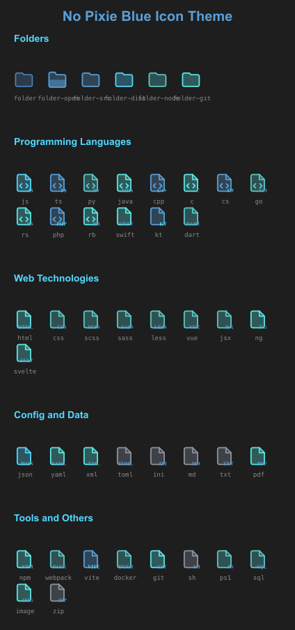

### Yellow Icon Theme

The Yellow icon theme uses warm yellow/amber colors that pair perfectly with the Yellow theme variants.

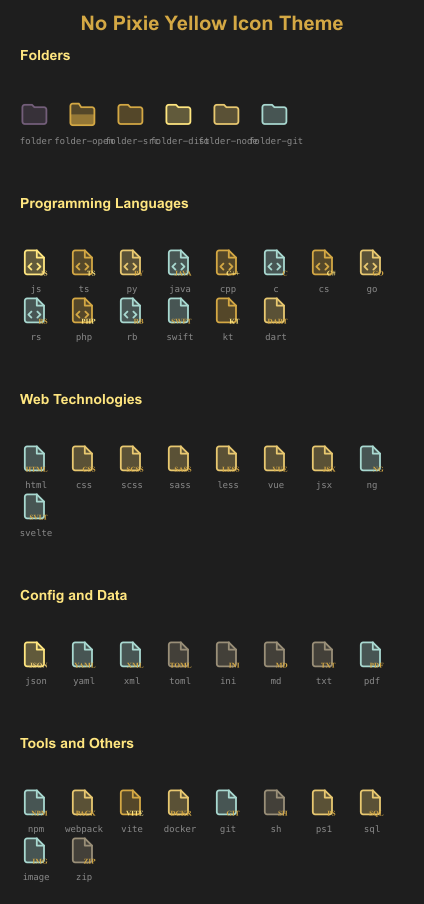


## Activation

### Color Theme

After installation, you can activate the color theme by:

1. Press `Ctrl+K Ctrl+T` (or `Cmd+K Cmd+T` on macOS)
2. Select one of the available themes:
   - **No Pixie Dark**
   - **No Pixie Light**
   - **No Pixie Dark High Contrast**
   - **No Pixie Light High Contrast**
   - **No Pixie Blue Dark**
   - **No Pixie Blue Light**
   - **No Pixie Yellow Dark**
   - **No Pixie Yellow Light**

Alternatively:
- Open Command Palette (`Ctrl+Shift+P` or `Cmd+Shift+P`)
- Type `Preferences: Color Theme`
- Select your preferred No Pixie theme

### Icon Theme

To activate the matching icon theme:

1. Open Command Palette (`Ctrl+Shift+P` or `Cmd+Shift+P`)
2. Type `Preferences: File Icon Theme`
3. Select one of the available icon themes:
   - **No Pixie Purple Icons** - Matches the original purple theme variants
   - **No Pixie Blue Icons** - Matches the blue theme variants
   - **No Pixie Yellow Icons** - Matches the yellow theme variants

The icon themes include:
- Custom folder icons for common directories (src, dist, node_modules, .git, tests, docs, config, public, components, utils)
- File type icons for 40+ languages and file types (JavaScript, TypeScript, Python, Java, C++, Go, Rust, PHP, Ruby, HTML, CSS, JSON, YAML, Markdown, and many more)
- Special icons for configuration files (package.json, webpack.config.js, Dockerfile, .gitignore)

## Feedback & Contributing

Found an issue or have a suggestion? Please open an issue on our [GitHub repository](https://github.com/nopixie/nopixie-theme).

## License

MIT License - see [LICENSE](LICENSE) file for details
